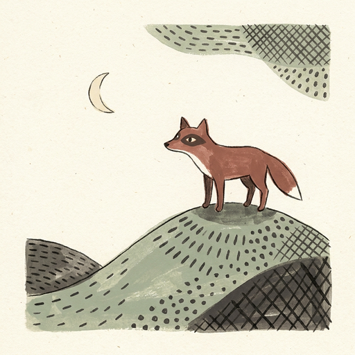
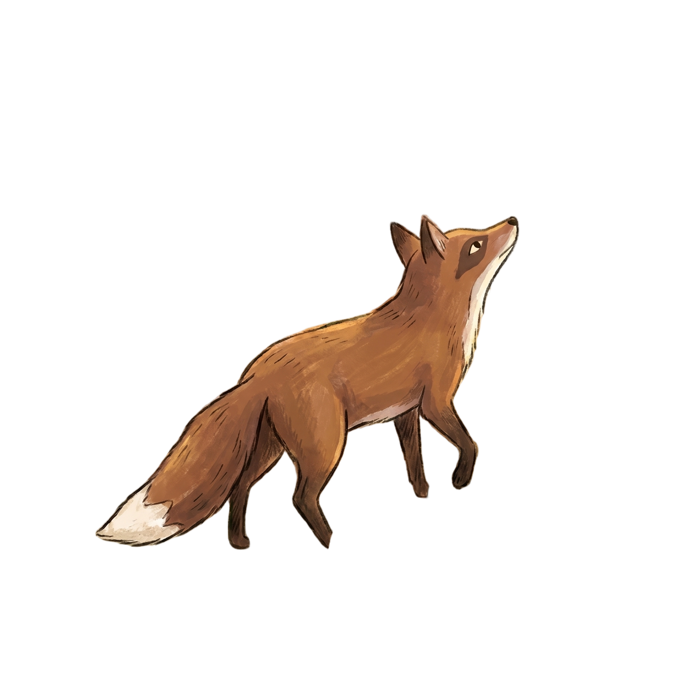
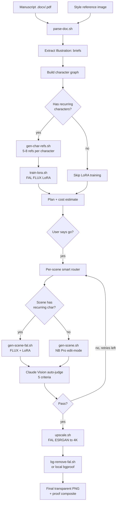

# Book Illustration Engine

> **Manuscript in. Print-ready, character-consistent, style-locked illustrations out.**
> An end-to-end pipeline that turns a `.docx` or `.pdf` and a single style reference into a finished set of 4K, background-removed PNGs — fully autonomous, fully resumable, fully judged for quality.

[](LICENSE)
[](https://github.com/anthropics/claude-code)
[](https://nano-banana.dev)
[](https://fal.ai)

---

## See it work

One style reference. Three different scenes. Same look, same world, same fox.

<table>
  <tr>
    <td align="center"><br/><sub><b>Style reference (input)</b></sub></td>
    <td align="center"><br/><sub>Scene 1 — fox at the vine (transparent PNG)</sub></td>
    <td align="center"><br/><sub>Scene 2 — mid-leap (transparent PNG)</sub></td>
    <td align="center"><br/><sub>Scene 3 — walking away (transparent PNG)</sub></td>
  </tr>
</table>

These outputs come from `bin/gen-scene.sh` running on the bundled `examples/fox-and-grapes/` sample. Same engine you'll run.

---

## Why this exists

Every children's book project hits the same wall. You can generate one beautiful AI illustration in fifteen seconds. You can't generate **forty consistent ones** without losing your mind.

Style drifts between scenes. Characters look like cousins, not the same person. The "same fox from page 4" turns up on page 12 with different fur, eyes, posture. You spend more time prompt-fixing than illustrating.

This engine solves the consistency problem programmatically:

- **Style is locked** by feeding the same reference image into every generation via Nano Banana Pro's edit-mode style transfer.
- **Characters are locked** by training a FAL FLUX LoRA per recurring character from auto-generated reference sheets.
- **Quality is gated** by Claude Vision auto-judging every output against five criteria, with up to two retries before flagging.
- **Cost is bounded** by a budget cap that halts the run before overrun.

The result: you upload a manuscript, watch the plan, hit "go," and come back to a folder of 4K transparent PNGs ready for layout.

---

## What it does

Takes two inputs:
1. A manuscript (`.docx` or `.pdf`) with inline `Illustration: …` markers
2. A style reference image (any PNG/JPEG)

And does, in order:

| Stage | What it does | Tool |
|---|---|---|
| **Parse** | Convert the manuscript to numbered plain text | `textutil` (mac) / `pdftotext` |
| **Extract briefs** | Find every `Illustration:` marker, classify each as hero scene / icon grid / cross-reference | bash + grep |
| **Build character graph** | Identify recurring characters across scenes, classify recurring vs one-off | bash + Claude reasoning |
| **Train LoRAs** | For each recurring character: auto-generate 5–8 reference images, submit to FAL for FLUX LoRA training | Nano Banana Pro + FAL |
| **Smart route** | Per scene: FAL+LoRA (recurring characters) or Nano Banana Pro (one-offs / anthology) | Pipeline router |
| **Generate** | Produce each scene with the chosen path; auto-judge against 5 criteria; retry up to 2x | FAL FLUX or NB Pro + Claude Vision |
| **Upscale** | All scenes to 4096px | FAL Real-ESRGAN |
| **Remove backgrounds** | Transparent PNGs with smart fallback chain | FAL birefnet → local `bgproof` |
| **Report** | Per-book workspace with final PNGs, proof composites, cost ledger, resumable manifest | bash |

The pipeline is **resumable**. A crash, a timeout, a Ctrl-C — re-running the engine picks up exactly where it left off, only spending money on the work that wasn't already done.

---

## How it works



### The smart router

For each scene, the router asks:

1. Does this scene contain a recurring character with a trained LoRA? → **FAL FLUX + LoRA path** (locks character identity).
2. Otherwise → **Nano Banana Pro edit-mode path** (locks style via the reference image).

You don't pick. The character graph picks for you, per scene.

### The auto-judge

Every generated scene is sent back to Claude Vision and scored on five criteria:

1. **Style match** — does it look like the reference?
2. **Subject coverage** — is every required character/object present?
3. **Character identity** — do recurring characters actually look like themselves?
4. **Composition** — sane framing, nothing cropped weirdly
5. **Technical quality** — no extra limbs, no garbled text, no frame artifacts

Failing scenes get re-rolled up to twice. Persistent failures are flagged in the manifest, not silently shipped.

---

## Install

### As a Claude Code plugin (recommended)

```text
/plugin marketplace add ayushnagvanshi101098-ship-it/book-illustration-engine
/plugin install book-illustration@ayush-plugins
```

Then in any Claude Code session:

> Illustrate ~/Downloads/my-book.docx, style ref ~/Desktop/my-style.png.

The skill bootstraps a workspace, parses the manuscript, builds the character graph, trains LoRAs if needed, and shows you the full plan with a cost estimate. Nothing spends money until you say "go."

### Standalone bash

```bash
git clone https://github.com/ayushnagvanshi101098-ship-it/book-illustration-engine.git
cd book-illustration-engine
cp .env.example .env
# fill in FAL_KEY, GEMINI_API_KEY (and ANTHROPIC_API_KEY if using Claude orchestration)
chmod +x bin/*.sh
```

The `bin/` scripts compose into the full pipeline. See `examples/fox-and-grapes/README.md` for a step-by-step walkthrough.

---

## Quick start with the bundled sample

The repo ships with a ready-to-run public-domain Aesop fable so you can prove the engine works on your machine before pointing it at your own book.

```bash
# 1. Parse the bundled manuscript (no API call, no money)
bin/parse-doc.sh examples/fox-and-grapes/manuscript.docx -o /tmp/parsed.txt
grep -c "Illustration:" /tmp/parsed.txt   # → 3

# 2. Generate one scene from the bundled brief + style ref (~$0.13)
echo "A red fox stands on his hind legs in a sunlit orchard, head tilted up at a vine of fat purple grapes. Watercolour storybook style." > /tmp/brief-1.txt
bin/gen-scene.sh \
  --brief /tmp/brief-1.txt \
  --style-ref examples/fox-and-grapes/style-ref.png \
  --output /tmp/fox-scene-1.jpeg

# 3. Upscale to 4K (~$0.04)
bin/upscale.sh --input /tmp/fox-scene-1.jpeg --output /tmp/fox-scene-1-4k.png --scale 2

# 4. Remove the background (~$0.02)
bin/bg-remove-fal.sh --input /tmp/fox-scene-1-4k.png --output /tmp/fox-scene-1-final.png
```

If all four steps succeed, your install is good.

---

## Cost

Per-operation pricing on default settings:

| Operation | Tool | Approx cost |
|---|---|---|
| Parse manuscript | `textutil` / `pdftotext` | free |
| Generate scene (NB Pro 2K) | Nano Banana Pro | ~$0.13 |
| Generate scene (FAL FLUX + LoRA) | FAL FLUX | ~$0.04 |
| Train one character LoRA | FAL LoRA training | ~$2.00 |
| Generate 5–8 character ref images | Nano Banana Pro | ~$0.65 – $1.04 |
| Upscale to 4K | FAL Real-ESRGAN | ~$0.04 |
| Remove background | FAL birefnet | ~$0.02 |
| Auto-judge (per scene) | Claude Vision | ~$0.01 |

Typical book totals (default budget cap is **$12**):

| Book type | Scenes | Recurring characters | Approx total |
|---|---|---|---|
| Anthology (one-off scenes) | 15 | 0 | **~$1.70** |
| Short narrative | 20 | 1 | **~$5.00** |
| Full picture book | 30 | 2 | **~$8.50** |

The skill's pre-flight plan shows the **exact** estimate for your book before spending anything. Tell the skill at invocation time if you want to raise the cap (e.g. *"…with a $20 budget"*).

---

## Requirements

- macOS or Linux, bash 4+
- `nano-banana` CLI (Nano Banana Pro / Gemini 3 Pro Image) — install per its own docs
- ImageMagick 7 (`magick` on PATH) — `brew install imagemagick`
- `pdftotext` from poppler — `brew install poppler`
- `textutil` (built-in on macOS) for `.docx` parsing
- `jq` for JSON manipulation — `brew install jq`
- A FAL account with an API key — sign up at https://fal.ai
- A Gemini API key (for Nano Banana Pro) — https://aistudio.google.com/apikey
- Optional: an Anthropic API key for Claude orchestration / auto-judge — https://console.anthropic.com

---

## What makes this different

| | Raw Midjourney / DALL-E | This engine |
|---|---|---|
| Character consistency across scenes | drift every gen | per-character LoRA |
| Style consistency across scenes | partial (--sref) | edit-mode style transfer |
| Quality gating | manual eyeball | automated 5-criteria judge |
| Crash recovery | re-run from scratch | resumable manifest |
| Cost visibility | post-hoc usage page | per-op ledger + budget cap |
| Output for print | screenshot the web UI | 4K transparent PNGs out of the box |
| Workflow for 30 scenes | 30 prompt sessions | one command |

---

## Configuration

Environment variables (set in `.env` or your shell):

| Variable | Required | Default | Purpose |
|---|---|---|---|
| `FAL_KEY` | yes | — | FAL auth (LoRA, FLUX, ESRGAN, birefnet) |
| `GEMINI_API_KEY` | yes | — | Nano Banana Pro auth |
| `ANTHROPIC_API_KEY` | optional | — | Claude orchestration + auto-judge |
| `BOOK_ENGINE_HOME` | optional | `~/book-illustration-engine` | Engine install location |

---

## Roadmap

Things on the list, not yet shipped:

- **Cross-book LoRA reuse** — reuse a trained character across multiple books (currently per-book isolated)
- **Icon grids and mini-posters** — currently skipped with reason
- **Cross-reference resolution** — "Same style as IF1" prompts (currently skipped)
- **Layout-aware composition** — generate scenes pre-sized for facing pages, full bleeds, spot illustrations
- **Composed book PDF** — drop the final PNGs into an InDesign-ready layout

PRs welcome. See `docs/architecture.md` for the design rationale.

---

## How it works under the hood

For the full design — character graph algorithm, smart router decision tree, manifest schema, fallback chains — see [`docs/architecture.md`](docs/architecture.md).

For the orchestration logic that runs under Claude Code — including the per-step prompts, gates, and recovery behavior — see [`skills/book-illustration/SKILL.md`](skills/book-illustration/SKILL.md).

---

## License

MIT — see [`LICENSE`](LICENSE). Use it commercially, fork it, ship it.

## Author

Built by [Ayush Nagvanshi](https://www.linkedin.com/in/ayush-nagvanshi/) — AI creative practitioner working on books, video, and brand at scale. Reach out on LinkedIn if you ship something with it.

If this saves you a weekend, a star is the cheapest way to say thanks.
