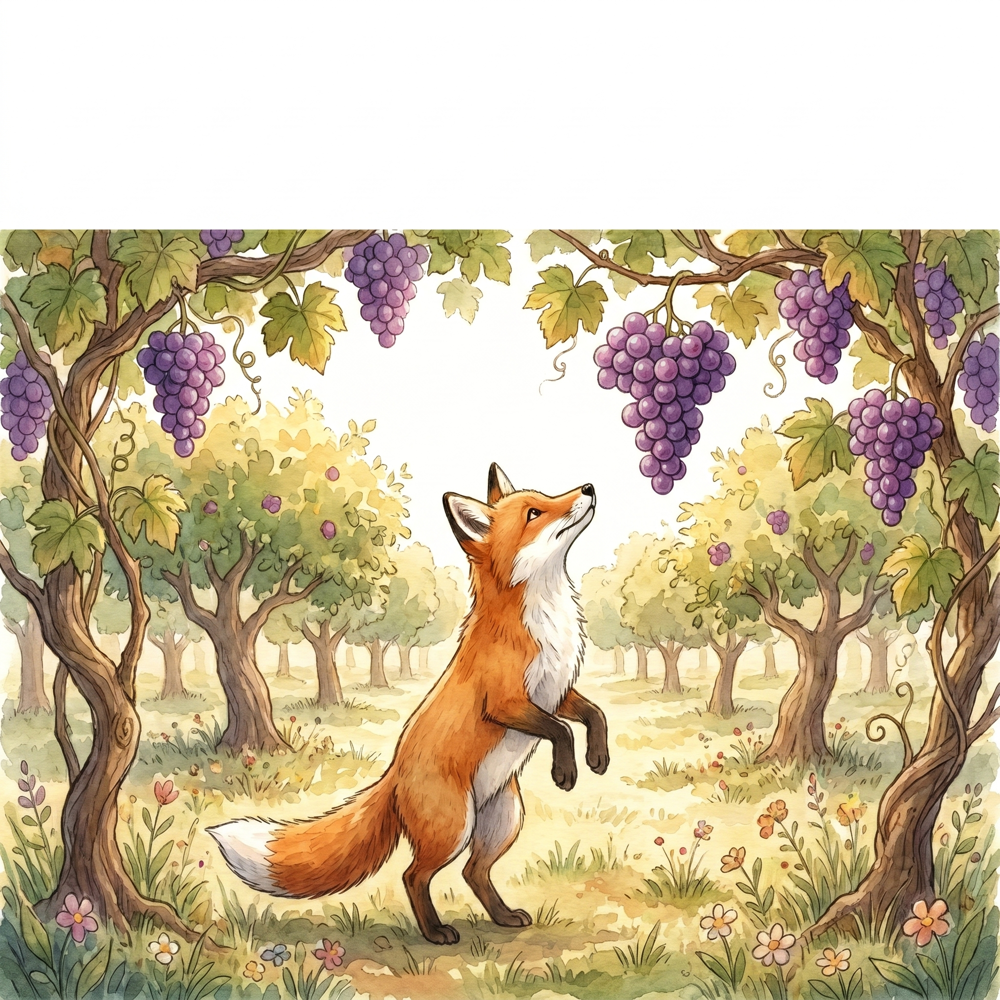

# Book Illustration Engine

End-to-end pipeline that turns a manuscript and a single style reference
into print-ready, character-consistent illustrations for children's books.



## What it does

Takes two inputs:
1. A manuscript (`.docx` or `.pdf`) with inline `Illustration: …` markers
2. A style reference image (any PNG/JPEG)

The engine:
- Extracts illustration briefs from the manuscript
- Auto-detects recurring characters across scenes
- Trains FAL FLUX LoRAs for character consistency (narrative books)
- Smart-routes each scene: FAL+LoRA for recurring characters, Nano Banana
  Pro for one-offs and anthologies
- Auto-judges quality with Claude vision (5 criteria, up to 2 retries)
- Upscales to 4K via FAL ESRGAN
- Removes backgrounds via FAL birefnet (or local `bgproof`)

Produces a per-book workspace with final transparent PNGs, proof
composites, a full cost ledger, and a resumable manifest.

## Install

### As a Claude Code plugin (recommended)

```text
/plugin marketplace add ayushnagvanshi101098-ship-it/book-illustration-engine
/plugin install book-illustration@ayush-plugins
```

Then in any Claude Code session:

> Illustrate ~/Downloads/my-book.docx, style ref ~/Desktop/my-style.png.

### Standalone bash

```bash
git clone https://github.com/ayushnagvanshi101098-ship-it/book-illustration-engine.git
cd book-illustration-engine
cp .env.example .env
# fill in FAL_KEY, GEMINI_API_KEY (and ANTHROPIC_API_KEY if using Claude)
chmod +x bin/*.sh
bin/parse-doc.sh examples/fox-and-grapes/manuscript.docx -o /tmp/parsed.txt
```

See `examples/fox-and-grapes/README.md` for a full standalone walkthrough.

## Requirements

- macOS or Linux, bash 4+
- `nano-banana` CLI (for Nano Banana Pro) — install per its own docs
- ImageMagick 7 (`magick` on PATH) — `brew install imagemagick`
- `pdftotext` (poppler) — `brew install poppler`
- `textutil` (built-in on macOS) for `.docx` parsing
- A FAL account — sign up at https://fal.ai

## Cost

Rough per-book cost on default settings:

- **Anthology** (independent scenes, no character LoRAs): ~$1.70
- **Narrative** (recurring characters, 1 LoRA per character): ~$6.50

The skill's pre-flight plan shows an exact estimate before spending anything.

## How it works

See [`docs/architecture.md`](docs/architecture.md) for the full design,
including the smart-router decision tree, quality judging criteria, and
the workspace/manifest layout.

## License

MIT — see [`LICENSE`](LICENSE).

## Author

Built by [Ayush Nagvanshi](https://www.linkedin.com/in/ayush-nagvanshi/).
